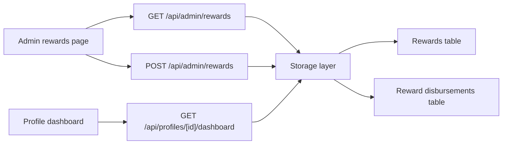

# Robux Disbursement Tracking - Technical Design

## Architecture Overview

The feature extends the existing household database with an append-only disbursement ledger. Reward events remain the source of truth for Robux a child has earned, while the new ledger records how much of that earned value has actually been handed to the child. The profile dashboard and admin page both read from the same persisted data so the displayed balance stays consistent.

The user-facing flow is:

1. A caregiver opens `/admin/rewards`.
2. The page loads the profile list plus reward balance summaries.
3. The caregiver enters a whole-number disbursement amount for a selected child.
4. The server validates the amount against the child's remaining undispatched balance, stores a new ledger entry, and returns the updated summary.
5. The dashboard at `/profile/[id]` shows the recomputed total rewarded, total disbursed, and remaining undispatched balance.

## Interface Design

### Admin Page

- Route: `/admin/rewards`
- Purpose: select a child, review their current reward balance, and record a new disbursement
- Primary controls:
  - Child selector or searchable picker
  - Amount input constrained to whole Robux
  - Submit button for creating the disbursement entry
- Supporting content:
  - Total rewarded Robux
  - Total disbursed Robux
  - Remaining undispatched balance
  - Recent disbursement history for the selected child

### Server API

#### `GET /api/admin/rewards`

Returns the data needed to render the admin page.

Suggested response shape:

```ts
{
  profiles: Array<{
    id: string
    name: string
    pointsTotal: number
    level: number
    rankKey: string
    rewardSummary: {
      totalRewarded: number
      totalDisbursed: number
      remainingUndispatched: number
    }
    recentDisbursements: Array<{
      id: string
      amount: number
      createdAt: string
    }>
  }>
}
```

#### `POST /api/admin/rewards`

Creates a new disbursement entry.

Suggested request shape:

```ts
{
  profileId: string
  amount: number
}
```

Suggested response shape:

```ts
{
  profileId: string
  rewardSummary: {
    totalRewarded: number
    totalDisbursed: number
    remainingUndispatched: number
  }
  disbursement: {
    id: string
    amount: number
    createdAt: string
  }
}
```

#### `GET /api/profiles/[id]/dashboard`

The existing dashboard view should be extended so it includes the reward summary needed by the profile page.

## Data Models

### `RewardDisbursement`

New persisted record for caregiver-entered payouts.

- `id: string`
- `profileId: string`
- `amount: number`
- `createdAt: string`

Constraints:

- `amount` must be a positive integer
- `profileId` must reference an existing child profile
- entries are append-only

### `RewardSummary`

Derived per profile from persisted reward events and disbursement entries.

- `totalRewarded: number`
- `totalDisbursed: number`
- `remainingUndispatched: number`

`remainingUndispatched` is computed from persisted records and should not be manually edited.

### Storage Changes

- Add a new SQLite table for disbursement entries.
- Extend the in-memory database shape to include the new collection.
- Keep reward events unchanged so session reward history remains stable.
- Update the schema version and migration logic so existing databases can initialize the new table.

## Key Components

### Storage Layer

Responsibilities:

- Read and persist the new disbursement ledger
- Maintain schema compatibility across resets and migrations
- Provide helper access for summary calculations

Public behavior:

- Database reads return the new ledger alongside existing profiles, rewards, sessions, and word progress.
- Writes persist the new ledger together with all other state.

### Dashboard Builder

Responsibilities:

- Calculate the reward summary for a single profile
- Keep the profile page focused on derived display data instead of repeated ad hoc queries

Dependencies:

- Reward events from the existing `rewards` table
- Disbursement ledger from the new table

### Admin Rewards API

Responsibilities:

- Return the selected profile list and reward summaries
- Validate disbursement submissions
- Persist new disbursement rows
- Return updated summaries after writes

### Admin Rewards Page

Responsibilities:

- Present a caregiver-friendly workflow for selecting a child and recording a disbursement
- Show the current balance clearly before submission
- Display recent entries so the caregiver can confirm what has already been recorded

### Profile Dashboard Page

Responsibilities:

- Surface the reward summary in the profile hero or stats area
- Preserve the existing profile layout and child-facing context

## User Interaction

1. The caregiver opens the admin rewards page.
2. The page loads profiles and computes each child's reward balance summary.
3. The caregiver selects a child and types a whole Robux amount.
4. The client shows inline validation if the value is invalid or too large.
5. On submit, the server validates the same constraints, records the ledger entry, and returns updated balance data.
6. The page updates the summary and history list without a full navigation.
7. The profile dashboard reflects the same derived totals on the next read.

## External Dependencies

- No new third-party services are required.
- The feature continues to use the existing Nuxt app, SQLite storage, and current browser runtime.

## Error Handling

- If the selected profile does not exist, the API returns a 404.
- If the amount is invalid, the API returns a 400 with a human-readable message.
- If the requested amount exceeds the remaining undispatched balance, the API rejects the write instead of clamping it silently.
- If the reward summary cannot be computed because of missing data, the UI should fail closed and show an empty or error state rather than inventing values.

## Security

- All balance calculations used for validation must happen on the server.
- The client may display a preview, but it must not be trusted as authoritative.
- The mutation endpoint should accept only the minimal fields needed to record a disbursement.
- The page is a local caregiver tool, so no new authentication system is introduced in this feature.

## Configuration

- No new environment variables are required.
- The existing database path and runtime config remain unchanged.
- Schema versioning may need to advance to account for the new storage table.

## Component Interactions



## Platform Considerations

- The implementation should follow the existing Nuxt server and page conventions already used by the profile and admin areas.
- Tests should stay source-level or pure-unit and should not require binding a local port or spawning the full server.
- Because the feature changes persistence, the local reset/seed scripts need to stay aligned with the database schema even if they do not add new seed rows.
